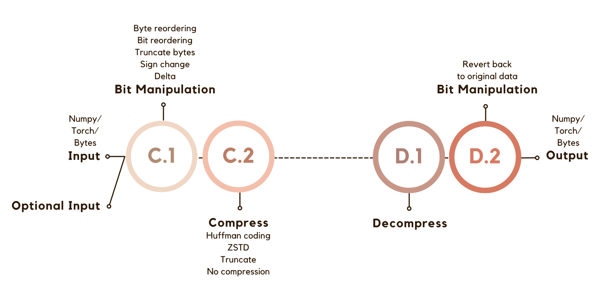

# ZipNN: <br> A Lossless Compression Library for AI pipelines


**TL;DR - simple, fast, and effective model compression.** 

**arXiv Paper**: ["ZipNN: Lossless Compression for AI Models"](https://arxiv.org/abs/2411.05239)

[](https://pepy.tech/project/zipnn) [](https://pepy.tech/project/zipnn) [](https://pypi.org/pypi/zipnn/)

##  PyPI Version 0.5.3 – Multithreading on CPU | Up to 80GB/s Decompression + supports FP8
🔹 Features: 
* supports **VLLM**, **safetensors** and **huggingface** - model is always compressed on the filesystem! <bf>

* **Performance Benchmark**:
With 16 workers and multithreading across two NUMA nodes, **decompression speeds** reach up to **80GB/s** and **compression speed** reach up to **13GB/s**
(Tested on Intel Xeon Platinum 8480+ with 224 cores and two NUMA nodes.)


## Contents

- [vLLM Integration](#vllm-integration)
- [HuggingFace Integration](#huggingface-integration)
- [Getting Started](#getting-started)
- [Introduction](#introduction)
- [Results](#results)
- [Usage](#usage)
- [Examples](#examples)
- [Configuration](#configuration)
- [Validation](#validation)
- [Support And Questions](#support-and-questions)
- [Contribution](#contribution)
- [Citation](#citation)
- [Change Log](#change-log)

## vLLM Integration

You can now use zipnn-compressed models in vLLM.
When running vLLM in a python interactive shell, simply run the following code before importing from vllm modules:

```python
from zipnn import zipnn_safetensors
zipnn_safetensors()
```

This will patch the safetensors python module, used by vLLM to load models in safetensors format.
The patch will enable the automatic detection and loading of zipnn-compressed models.

#### GPT2 using vllm
```python
from zipnn import zipnn_safetensors;
from vllm import LLM
zipnn_safetensors();

llm = LLM("zipnn/gpt2-ZipNN")

prompt = "Once upon a time,"
outputs = llm.generate([prompt])
print(outputs[0].outputs[0].text)
```

#### vLLM in a container
If you use vLLM in a container (for example by using the `vllm/vllm-openai:latest` image),
you can extend that image with zipnn support by building a new image on top of it using the Dockerfile
found in the root of the zipnn project:

```
docker build --build-arg BASE_IMAGE=vllm/vllm-openai:latest -t vllm-openai:zipnn .
```

This will build a new image `vllm-openai:zipnn` that you can use to run vLLM in a container with zipnn support.
Alternatively, you can simply use the pre-built `zipnn/vllm-openai:latest` image.

Note that the above methods can work not just for vLLM, but for any application that uses the safetensors python library
(including `sglang`).

For additional examples of our vLLM integration, please refer to the [vLLM and Docker Examples.](examples#run-vllm-with-zipnn)


## HuggingFace Integration

You can now choose to save the model compressed on your local storage by using the plugin. When loading, the model includes a fast decompression phase on the CPU while remaining compressed on your storage.

**What this means:** Each time you load the model, less data is transferred to the GPU cluster, with decompression happening on the CPU.

### Safetensors Plugin

Specifically for safetensors files we suggest using a plugin made for the safetensors library to use ZipNN compression, for even better performance.
```python
from zipnn import zipnn_safetensors
zipnn_safetensors()
```

[Click here](./docs/HuggingFace.md) to see full Hugging Face integration documentation.

Try our examples showcasing the use of a compressed GPT-2 model with [vLLM](examples/gpt2-zipnn_vllm.py) or [Hugging Face from_pretrained](examples/gpt2-zipnn_from_pretrained.py).

### Download Compressed Models from Hugging Face

First, make sure you have ZipNN installed:
```bash
pip install zipnn
```
Then, simply add ```zipnn_safetensors()``` at the beginning of the file, and from then on proceed as normally. The plugin will let you keep the compressed model in storage, while decompressing it quickly when loaded.

#### GPT2 using from_pretrained
```python
from transformers import AutoModelForCausalLM, AutoTokenizer
from zipnn import zipnn_safetensors
zipnn_safetensors()

model = "zipnn/gpt2-ZipNN"
tokenizer = AutoTokenizer.from_pretrained(model)
model = AutoModelForCausalLM.from_pretrained(model, variant="znn")

prompt = "Once upon a time,"
inputs = tokenizer(prompt, return_tensors="pt")
outputs = model.generate(**inputs, max_length=10)
generated_text = tokenizer.decode(outputs[0], skip_special_tokens=True)
print(generated_text)
```

### Other file types

For any other type of file which isn't a safetensors file, please use our huggingface plugin.

```python
zipnn_hf()
```

Alternatively, you can save the model uncompressed on your local storage. This way, future loads won’t require a decompression phase.

```python
zipnn_hf(replace_local_file=True)
```

Try state-of-the-art compressed models that are already present on HuggingFace, such as [Roberta Base]( https://huggingface.co/royleibov/roberta-base-ZipNN-Compressed ), [Granite 3.0](https://huggingface.co/royleibov/granite-3.0-8b-instruct-ZipNN-Compressed), [Llama 3.2]( https://huggingface.co/royleibov/Llama-3.2-11B-Vision-Instruct-ZipNN-Compressed ).

You can also try one of these python notebooks hosted on Kaggle: [granite 3b](https://www.kaggle.com/code/royleibovitz/huggingface-granite-3b-example), [Llama 3.2](https://www.kaggle.com/code/royleibovitz/huggingface-llama-3-2-example), [phi 3.5](https://www.kaggle.com/code/royleibovitz/huggingface-phi-3-5-example).

Additionally, we've provided numerous examples showcasing the HF plugin, which can be run on the command line with various popular models, available in [this folder.](examples/huggingface%20exmaples)

## Getting Started
This repository provides command-line scripts for efficient file compression and decompression using ZipNN, offering few methods, such as a standard compression for general use, safetensors compression for efficient tensor-by-tensor compression of safetensors files, and path-based batch compression, to apply for all relevant files in a directory.

More information regarding the scripts can be found [in the scripts folder's README.](https://github.com/guygir/zipnn/blob/main/scripts/README.md)

To download the scripts for compressing/decompressing AI Models:
```
wget -i https://raw.githubusercontent.com/zipnn/zipnn/main/scripts/scripts.txt
```
We recommend using safetensors compression when possible. To apply it, run:
```
python3 zipnn_compress_safetensors.py safetensors_path
```
For batch compression in a directory:
```
python3 zipnn_compress_path.py .safetensors
```
To decompress a compressed safetensors file:
```
python zipnn_decompress_path_safetensors.py compressed_safetensors_path
```

## Introduction

In the realm of data compression, achieving a high compression/decompression ratio often requires careful consideration of the data types and the nature of the datasets being compressed. For instance, different strategies may be optimal for floating-point numbers compared to integers, and datasets in monotonic order may benefit from distinct preparations.

ZipNN (The NN stands for Neural Networks) is a lossless compression library optimized for numbers/tensors in the Foundation Models environment, designed to automatically prepare the data for compression according to its type. By simply calling zipnn.compress(data), users can rely on the package to apply the most effective compression technique under the hood.

Given a specific data set, ZipNN automatically rearranges the data according to it's type, and applies the most effective techniques for the given instance to improve compression ratios and speed.
It is especially effective for BF16 models, typically saving 33% of the model size, whereas with models of type FP32 it usually reduces the model size by 17%.
<!-- With zipnn, users can focus on their core tasks without worrying about the complexities of data compression, confident that the package will deliver the best possible results for their specific data types and structures. --> 


The techniques employed in ZipNN are described in our paper: [ZipNN: Lossless Compression for AI Models](https://arxiv.org/abs/2411.05239)

Currently, ZipNN compression methods are implemented on CPUs, and GPU implementations are on the way. 


<p align="center">
  
</p>

## Results

Below is a comparison of compression results between ZipNN and several other methods on bfloat16 data.

| Compressor name | Compression ratio / Output size | Compression Throughput | Decompression Throughput |
|-----------|--------------------------------|------------------------|--------------------------|
| ZipNN v0.2.0    | 1.51 / 66.3%                 | 1120MB/sec          | 1660MB/sec            |
| ZSTD v1.56     | 1.27 / 78.3%                 | 785MB/sec           | 950MB/sec             |
| LZ4       | 1 / 100%                     | ---                    | ---                      |
| Snappy    | 1 / 100%                     | ---                    | ---                      |


* Gzip, Zlib compression rate are similar to ZSTD, but much slower.
* The above results are for a single-threaded compression (Working with chunks size of 256KB).
* Similar results with other BF16 Models such as Mistral, Lamma-3, Lamma-3.1, Arcee-Nova and Jamba.

## Usage

### Installation using pip

```sh
pip install zipnn
```
This project requires the numpy, zstandard and torch python packages.

### Ready Made Scripts for file Compression/ Decompression

You can integrate zipnn compression and decompression into your own projects by utilizing the scripts available in the scripts folder. This folder contains the following scripts:
* ```zipnn_compress_file.py```: For compressing an individual file.
* ```zipnn_decompress_file.py```: For decompressing an individual file.
* ```zipnn_compress_path.py```: For compressing all files under a path.
* ```zipnn_decompress_path.py```: For decompressing all files under a path.

Compress one file:
```
python zipnn_compress_file.py model_name
```

Decompress one file:
```
python zipnn_decompress_file.py model_name.znn
```

For detailed information on how to use these scripts, please refer to the [README.md](./scripts/README.md) file located in the scripts folder.

## Examples

In this example, ZipNN compress and decompress 1GB of the Granite model and validate that the original file and the decompressed file are equal. <br>
The script reads the file and compresses and decompresses in Byte format.
```
> python3 simple_example_granite.py
...
Are the original and decompressed byte strings the same [BYTE]?  True
```

Similar examples demonstrating compression and decompression for Byte and Torch formats are included within the package.

```
> python3 simple_example_byte.py
...
Are the original and decompressed byte strings the same [BYTE]?  True
```

```
> python3 simple_example_torch.py
...
Are the original and decompressed byte strings the same [TORCH]?  True
```

For many more examples showcasing our various scripts, methods, and plugins, please refer to the [examples folder.](examples)
## Configuration

The default configuration is ByteGrouping of 4 with vanilla ZSTD, and the input and outputs are "byte". For more advanced options, please consider the following parameters:

* ```method```: Compression method, Supporting zstd, lz4, huffman and auto which chooses the best compression method automaticaly (default value = 'auto').
* ```input_format```: The input data format, can be one of the following: torch, numpy, byte (default value = 'byte').
* ```bytearray_dtype```: The data type of the byte array, if input_format is 'byte'. If input_format is torch or numpy, the dtype will be derived from the data automatically (default value = 'bfloat16').
* ```threads```: The maximum threads for the compression and the bit manipulation. (default value = maximal amount of threads).
* ```compression_threshold```: Save original buffer if not compress above the threshold (default value = 0.95).
* ```check_th_after_percent```: Check the compression threshold after % from the number of chunk and stop compressing if not pass the compression_threshold. (default value = 10[%]).
*  ```compression_chunk```: Chunk size for compression. (default value = 256KB).
*  ```is_streaming```: A flag to compress the data using streaming. (default value = False).
*  ```streaming_chunk```: Chunk size for streaming, only relevant if is_streaming is True. (default value = 1KB).

Additional configuration can be done using our pre-made scripts for compressing and decompressing files, which can be thoroughly reviewed in the [scripts' README.](scripts/README.md)

## Validation

Run tests for Byte/File input types, Byte/File compression types, Byte/File decompression types.
```sh
python3 -m unittest discover -s tests/ -p test_suit.py
```

## Support And Questions

We are excited to hear your feedback!
For issues and feature requests, please open a GitHub issue.

## Contribution

We welcome and value all contributions to the project!
You can contact us in this email: zipnn_compression@gmail.com

## Citation

If you use `zipnn` in your research or projects, please cite the repository:

```
@misc{hershcovitch2024zipnnlosslesscompressionai,
      title={ZipNN: Lossless Compression for AI Models}, 
      author={Moshik Hershcovitch and Andrew Wood and Leshem Choshen and Guy Girmonsky and Roy Leibovitz and Ilias Ennmouri and Michal Malka and Peter Chin and Swaminathan Sundararaman and Danny Harnik},
      year={2024},
      eprint={2411.05239},
      archivePrefix={arXiv},
      primaryClass={cs.LG},
      url={https://arxiv.org/abs/2411.05239}, 
}
```

## Change Log

##### v0.5.3

* Add support for FP8 models, including both float8_e4m3fn and float8_e5m2.

##### v0.5.2

* Extends the zipnn_safetensors monkey patching to
propagate to spawned processes and limits the default thread count during compression to 16

##### v0.5.1

* Add ZipNN Plugin to Safetensors (Monkey Patching)
The compression is applied per layer rather than to the entire file and supports model saving with Safetensors. The new file suffix is .znn.safetensor. This method is compatible with Hugging Face Transformers and vLLM.
 
##### v0.5.0

* Add multithreading support on the CPU for both compression and decompression, with the default set to the number of logical CPU threads.

##### v0.4.0

* Update the Hugging Face plugin to support loading compressed files and add an option to save them uncompressed.

* Fix the Hugging Face plugin to support different versions of Hugging Face Transformers.


##### v0.3.6

* Fix bug that causes memory leaks in corner cases

##### v0.3.5

* Add float32 to the C implementation with Huffman compression.

##### v0.3.4

* Plugin for Hugging Face transformers to allow using from_pretrained and decompressing the model after downloading it from Hugging Face.

* Add Delta compression support in python -> save Xor between two models and compress them).  

##### v0.3.2

* Change ZipNN suffix from .zpn to .znn 

##### v0.3.1

* Prepare dtype16 (BF16 and FP16) for multi-threading by changing its C logic. For each chunk, byte ordering, bit ordering, and compression are processed separately.

* Integrate the Streaming support into zipnn python code.

##### v0.2.4

* Add support for Streaming when using outside scripts

* Fix bug: Compression didn't work when compressing files larger than 3GB

##### v0.2.3

* Change the byte ordering implementation to C (for better performance).

* Change the bfloat16/float16 implementation to a C implementation with Huffman encoding, running on chunks of 256KB each.
  
* Float 32 using ZSTD compression as in v0.1.1

* Add support with uint32 with ZSTD compression.

##### v0.1.1

* Python implementation of compressing Models, float32, float15, bfloat16 with byte ordering and ZSTD.
