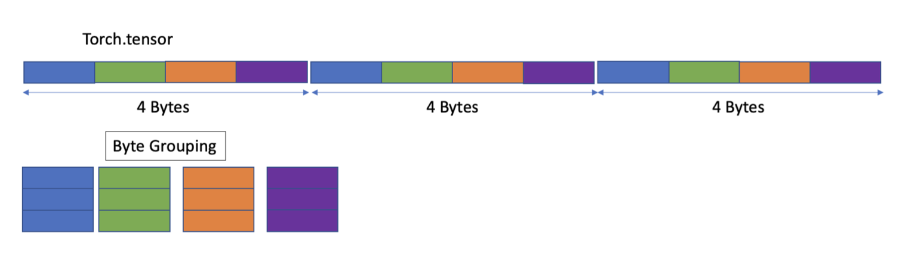
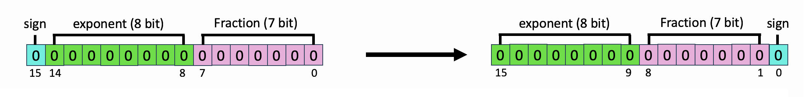
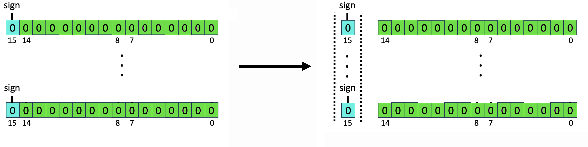
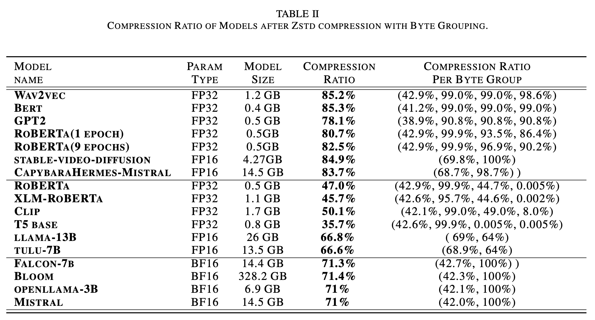

# ZipNN Bit Manipulation 

## Introduction

With the growth of model sizes and the scale of their deployment, their sheer size burdens the infrastructure requiring more network and more storage to accommodate these. While there is a vast literature about reducing model sizes, we investigate a more traditional type of compression – one that compresses the model to a smaller form and is coupled with a decompression algorithm that returns it to its original size – namely lossless compression. In Lossless and Near-Lossless Compression for Foundation Models we show that specific lossless compression can gain significant network and storage reduction on popular models, at times reducing over 50% of the model size.

In this README, we'll outline the supported data types and the various techniques tailored for these data types that are being used in the zipnn package.  When the user calls ```zipnn.compress(data)``` , the package automatically selects and applies the most effective compression technique from its arsenal, ensuring optimal compression results.

## Byte Grouping

After exploring the source of compressibility in models we implemented byte grouping – an adaptation that is tailored for the models' use case. The method rearranges the bytes in a model to compress the different bytes of the parameters together. This results in grouping of similar bytes which in turn yields better compression. If each parameter in the model consists of several bytes (typically 2 or 4 bytes), then group together the first byte from all parameters, then the second byte, etc.

<p align="center">
  
</p>

### Truncate zero Bytes

Truncate all-zero bytes. This enhances the compression ratio and reduces both compression and decompression times. This method is ideal for unsigned data types and also beneficial for certain FP32 models.

## Signbit handeling

Another observation is that the sign bit tends to hold high entropy and that compressing it together with the exponent byte interferes with compression effectiveness. To overcome this, we implemented two approaches that you can choose from to deal with the sign bits.

### Signbit reordering

This is beneficial for floating-point numbers, as the exponent can be stored separately, improving the compression ratio with minimal compression overhead.
<p align="center">
  
</p>

### ABS and Signbit array

Converts integer data types to unsigned data types and stores the sign bit in a separate array. This is beneficial for integers, as their two-component format is not ideal for achieving a high compression ratio.
<p align="center">
  
</p>

## More advanced data type preparations

### Tunable Lossy compression

Fine-tuning of models often degrades their compressibility (at times significantly). This high entropy in the parameters often stems from minuscule updates. To overcome this, we introduce a novel tunable lossy compression method that can significantly improve compression ratio with no measurable harm to model accuracy.

In a nutshell, this technique allows for incurring controlled inaccuracies to parameters, under the assumption that a lot of the entropy in model weights is actually redundant, i.e., noise saved to disk. This is done by casting every parameter into an integer representation with a chosen level of fixed precision, in essence trimming some of the least bits. Then compression follows as before using byte grouping and a standard lossless compressor.

Formally, given a parameter θ in floating point representation, and precision B = $2^b$ the casting is done by first multipling the parameter by the precision factor and then cast it into an integer, effectively rounding it to ⌊θ · B⌋. The transformed parameters are then fed into a standard lossless compressor. During decompression, the stream first undergoes standard decompression and then the resulting integers are transformed into floating point after division by the precision factor.

### Delta compression

The delta (difference) between two consecutive checkpoints decline over time. When models have high similarity, one strategy to optimize storage and network transfer is to save a base model and for the rest of the models only store the differences from this base model. We refer to compressing those differences as delta compression. To reconstruct a model, one only needs to apply the delta to the base model. A straightforward approach to delta compression is to compute the difference between the two models (e.g. using XOR or subtraction) and compress this delta using a standard compressor. This method is useful for checkpointing and management of model variations.

## Data types

### Floating point

Byte grouping and rearranging the sign can enhance the compression ratio and reduce decompression time. Additionally, if the lower byte of the mantissa is zero, it can be truncated.

The exponent is compressible; by isolating it, we can achieve better compression. There is no significant benefit in entropy encoding for the mantissa. However, for the mantissa, in cases where the least significant bytes are all zeros (e.g., training with bfloat16 and saving with float32), they can be truncated.

#### Formats

* float32 - Bytegroup with 4 partitions, rearrange the exponent into a separate byte, and truncate zero bytes in the mantissa.
* bflot16 - ByteGroup with 2 partitions and rearrange the exponent into a separate byte.
* float16 - ByteGroup with 2 partitions.

#### Use cases

AI Models/Gradients/Optimizers/Embeddings - see our paper for detailed information.

### Positive Integer (UNSIGN)

Truncate the zero bytes: Often, the maximum value doesn't reach the data type limit, leaving some of the most significant bytes (MSBytes) as all zeros. These bytes can be truncated, enhancing the compression ratio by reducing the need to handle zeros, which also improves both compression and decompression times.

For bytes with many zeros but not all, the dataset should be reviewed to determine the best approach. Once the data is available, we can benchmark it to decide the optimal method.


#### Formats

* uint64 - Likely to have many bytes that can be truncated.
* uint32 - Can have some bytes that can be truncated.

#### Use cases

Tokenizer

### Positive Integer (UNSIGN) with a data set of Monotonic Order 

Byte grouping is highly effective for this kind of dataset. Since there are no repetitions of the same value (except for consecutive numbers), this method optimizes compression.

#### Formats

* uint64 - Truncate zeros and ByteGroup with 8 partitions
* uint32 - Truncate zeros and ByteGroup with 4 partitions
* uint16 - Truncate zeros and ByteGroup with 2 partitions

#### Use cases

Addresses, see new HotStorage paper 2024 / indexes.

### Integer

Integers with negative values pose a compression challenge due to the two-complement format. To address this, we first save their sign bit in a separate array and then transfer them to unsigned format using absolute values. This approach significantly improves the compression ratio.

#### Formats

* int64 -
* int32 -
* int16 -
* int8 -

#### Use cases

our lossy compression (need to check for more datasets).

# Results

While model compressibility has high variance, we observe that there are essentially three popular categories of models from a compressibility standpoint.

* The first category of models are mainly compressible in the exponent and hence have more modest savings. The main source of compressibility for these models is the exponent byte which is highly compressible. Those models are saved in FP32 of FP16.
* The second category includes “clean” models, or base models. These have high compressibility stemming from both the exponent and the two lower bytes of the mantissa. The second byte, in all cases, is incompressible and holds most of the model’s entropy. Overall these models show very high compressibility.
* The final category is of BF16 models that show ∼30% space savings. Like the first group, the exponent is very compressible, and the mantissa is not, but in these models, the savings are more significant as the exponent makes up a larger part of the model.



These are older results, so the results may vary slightly, but they clearly and visually highlight the differences in compressibility between model categories, making it easy to understand.

# Additional ZipNN Configuration

Below are additional arguments you can provide to ZipNN to tailor the compression to your needs:

* ```input_file```: Path to the input file. If ‘file’ is the input_format – enter file name. (default value = 'byte').
* ```compressed_file```: Path to the compressed file. Only relevant if input_format is ‘file’. (default value = None).
* ```decompressed_file```: Path to the decompressed file. Only relevant if input_format is ‘file’. (default value = None).
* ```zstd_level```: Compression level for ‘zstd’ compression. Only relevant if method is ‘zstd’. (default value = 3).
* ```lz4_compression_level```: Compression level for ‘lz4’ compression. Only relevant if method is ‘lz4’. (default value = 0).
 
