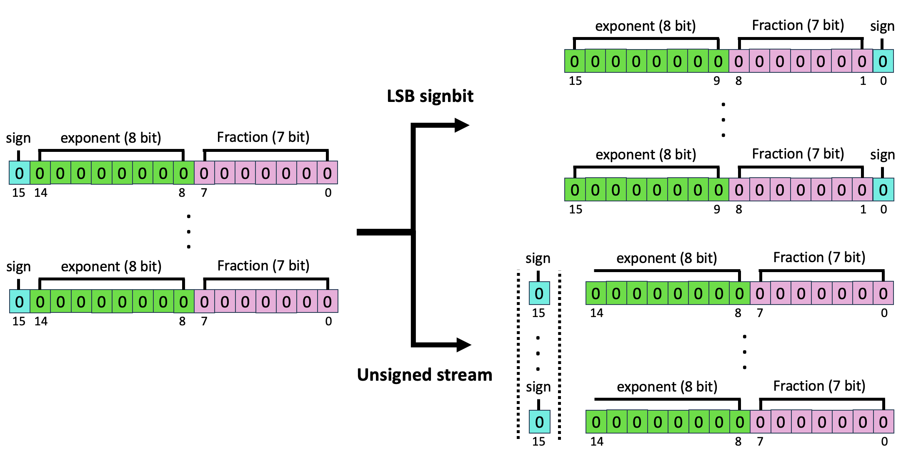

# ZipNN Bit Mnipulation 

## Introduction

With the growth of model sizes and the scale of their deployment, their sheer size burdens the infrastructure requiring more network and more storage to accommodate these. While there is a vast literature about reducing model sizes, we investigate a more traditional type of compression – one that compresses the model to a smaller form and is coupled with a decompression algorithm that returns it to its original size – namely lossless compression. In Lossless and Near-Lossless Compression for Foundation Models we show that specific lossless compression can gain significant network and storage reduction on popular models, at times reducing over 50% of the model size.

## Byte Grouping

After exploring the source of compressibility in models we implemented byte grouping – an adaptation that is tailored for the models' use case. The method rearranges the bytes in a model to compress the different bytes of the parameters together. This results in grouping of similar bytes which in turn yields better compression. If each parameter in the model consists of several bytes (typically 2 or 4 bytes), then group together the first byte from all parameters, then the second byte, etc.

  

## Signbit handeling

Another observation is that the sign bit tends to hold high entropy and that compressing it together with the exponent byte interferes with compression effectiveness. To overcome this, we implemented two approaches that you can choose from to deal with the sign bits.

The first approach is to translate the stream into an unsigned stream (for example, using the abs function) and store the sign values separately. The unsigned values are then fed into the compressor. This method can further improve the compression ratio without further affecting the precision.

The second approach is moving the signbit as the LSB, ...

  

## Tunable Lossy compression

Fine-tuning of models often degrades their compressibility (at times significantly). This high entropy in the parameters often stems from minuscule updates. To overcome this, we introduce a novel tunable lossy compression method that can significantly improve compression ratio with no measurable harm to model accuracy.

In a nutshell, this technique allows for incurring controlled inaccuracies to parameters, under the assumption that a lot of the entropy in model weights is actually redundant, i.e., noise saved to disk. This is done by casting every parameter into an integer representation with a chosen level of fixed precision, in essence trimming some of the least bits. Then compression follows as before using byte grouping and a standard lossless compressor.

Formally, given a parameter θ in floating point representation, and precision B = $2^b$ the casting is done by first multipling the parameter by the precision factor and then cast it into an integer, effectively rounding it to ⌊θ · B⌋. The transformed parameters are then fed into a standard lossless compressor. During decompression, the stream first undergoes standard decompression and then the resulting integers are transformed into floating point after division by the precision factor.

## Delta compression

When models have high similarity, one strategy to optimize storage and network transfer is to save a base model and for the rest of the models only store the differences from this base model. We refer to compressing those differences as delta compression. To reconstruct a model, one only needs to apply the delta to the base model. A straightforward approach to delta compression is to compute the difference between the two models (e.g. using XOR or subtraction) and compress this delta using a standard compressor. This method is useful for checkpointing and management of model variations.

# Results

While model compressibility has high variance, we observe that there are essentially three popular categories of models from a compressibility standpoint.

* The first category of models are mainly compressible in the exponent and hence have more modest savings. The main source of compressibility for these models is the exponent byte which is highly compressible. Those models are saved in FP32 of FP16.
* The second category includes “clean” models, or base models. These have high compressibility stemming from both the exponent and the two lower bytes of the mantissa. The second byte, in all cases, is incompressible and holds most of the model’s entropy. Overall these models show very high compressibility.
* The final category is of BF16 models that show ∼30% space savings. Like the first group, the exponent is very compressible, and the mantissa is not, but in these models, the savings are more significant as the exponent makes up a larger part of the model.

